# Individual Formative Assignment

[Site preview link](https://sandywyper.github.io/safeguarding/)

---

### Front-End Design

I used chat_GPT and Gemini to expand on this criteria. It provided a detailed plan for building out each section, making sure to explain how each section responds on different screen sizes.

I even got chatGPT to format the plan into markdown.

The file can be found in the root of the directory - [WireFrameChat.md](WireFrameChat.md)

### Purpose

The purpose of this website is to provide clear and easy-to-understand information on safeguarding practices, including how to recognize and respond to safeguarding concerns. It aims to educate users on the key principles of safeguarding in a simple and intuitive manner.

### User Value

**Empowerment through Knowledge:**

- _Increased Awareness:_ Users gain a clear understanding of what safeguarding means, helping them to be more aware of potential risks to themselves or others.
- _Ability to Recognize Concerns:_ The site will equip users with the knowledge to identify signs of abuse, neglect, or other safeguarding issues, even if subtle.
- _Confidence to Act:_ By outlining response procedures, the site empowers users to know what steps to take when a concern arises, rather than feeling helpless or unsure.

**Safety and Well-being:**

- _Protection for Vulnerable Individuals:_ For individuals who may be at risk or experiencing harm, the site provides crucial information on how to seek help or how others can report concerns on their behalf.
- _Safer Environments:_ When more people understand and practice good safeguarding principles, it contributes to the creation of safer environments in communities, workplaces, and homes.
- _Prevention of Harm:_ By understanding proactive safeguarding measures, users can contribute to preventing harm from occurring in the first place.

**Clarity and Accessibility:**

- _Easy-to-Understand Information:_ The simple and intuitive layout ensures that complex safeguarding concepts are presented in a digestible way, making it accessible to a wide audience regardless of their prior knowledge.
- _Quick Reference:_ The structured content allows users to quickly find specific information they need, whether it's about recognizing a particular type of concern or understanding reporting procedures.
- _Reduced Anxiety/Confusion:_ In situations where safeguarding concerns arise, the site provides a clear pathway for action, reducing anxiety and confusion for those who need to respond.

**Ethical and Legal Compliance (for some users):**

- _Meeting Responsibilities:_ For individuals in roles that require safeguarding knowledge (e.g., volunteers, community workers, parents), the site helps them understand and meet their ethical and potentially legal responsibilities.
- _Promoting Best Practice:_ By providing clear guidelines, the site encourages the adoption of best safeguarding practices across various contexts.

### Deployment

Followed the instruction in the [astro docs.](https://docs.astro.build/en/guides/deploy/github/)

1. Update `astro.config.hjs`
2. Configure a gitHub Action to build to the site ( making sure to reference the correct branch name )
3. In GitHub Pages settings, under Build and Deployment, select GitHub Actions.

Now every time the remote repository on that branch receives an update the site will automatically build and deploy.

---

### Site Overview

Site is built using the [Astro.js](https://astro.build/) framework. It is great for working with classic HTML structure, whilst utilizing modern web architecture and libraries.

I used [Tailwind](https://tailwindcss.com/) instead of Bootstrap. Tailwind CSS offers greater design flexibility and cleaner code by using utility-first classes, allowing you to build custom UIs without fighting pre-styled components like in Bootstrap. It produces smaller CSS bundles thanks to built-in purging, promotes consistency through design tokens, and fits seamlessly into modern, component-based workflows—making it more scalable and efficient for long-term projects.

##### Hero

**Description:**  
A clear, impactful introduction to safeguarding with a call to action.

**Benefits for Users:**

- Immediate understanding of the site’s purpose
- Quick access to key safeguarding resources
- Encourages engagement through a clear CTA

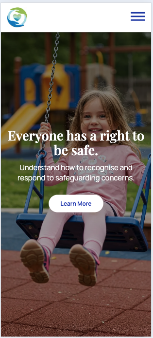
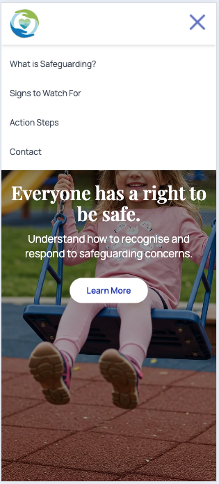
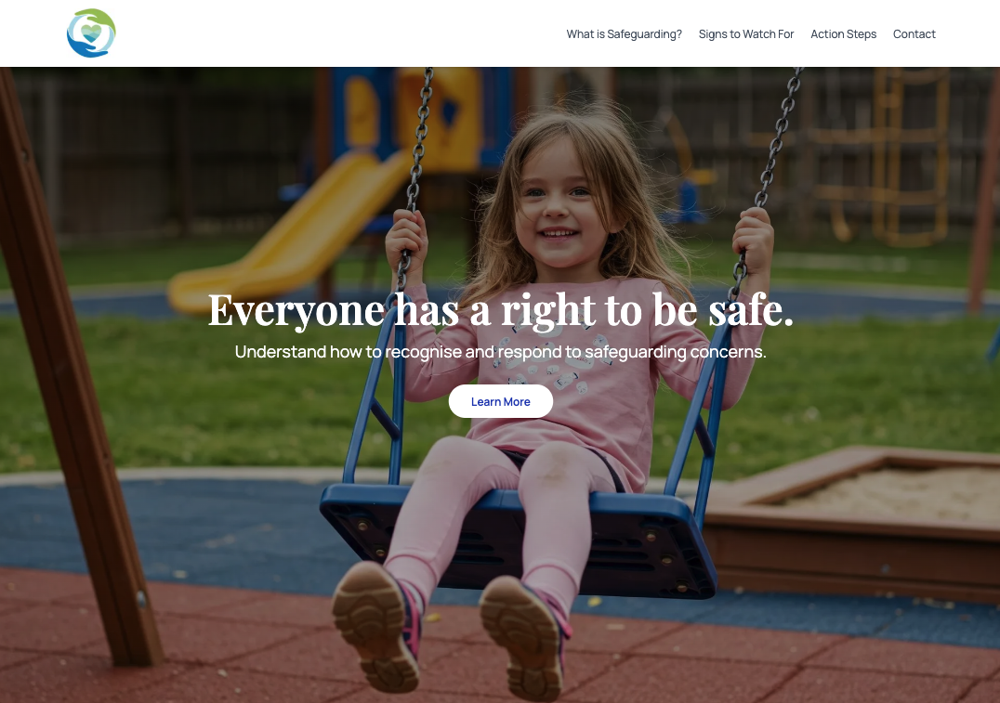

##### What is Safeguarding and Video Modal

**Description:**  
Explains safeguarding in simple terms and includes an informative video.

**Benefits for Users:**

- Understands the concept of safeguarding quickly
- Engaging visual explanation for better retention
- Builds awareness and trust

_\*Screen shots taken before video added_

    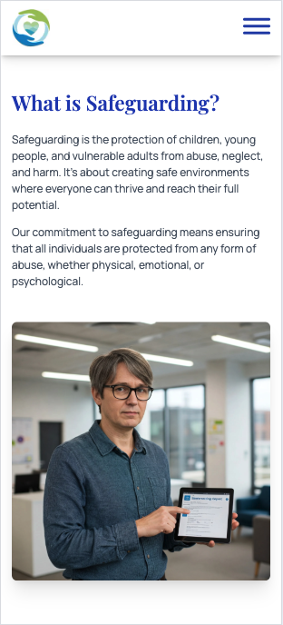
       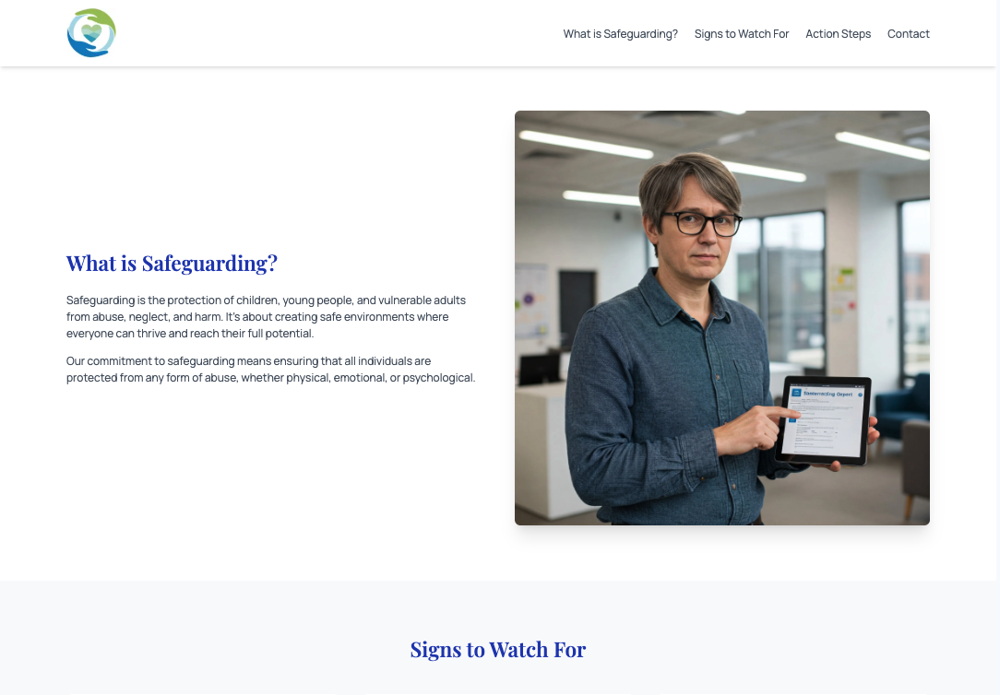

##### Signs to Watch For

**Description:**  
Outlines common indicators of abuse or neglect across different age groups.

**Benefits for Users:**

- Raises awareness of potential red flags
- Helps users spot issues early
- Encourages proactive vigilance

    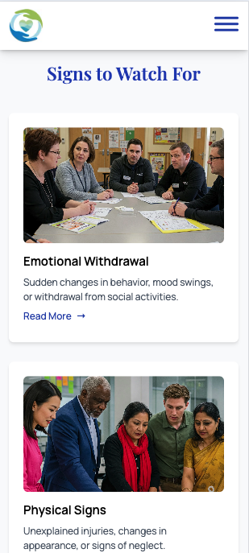
    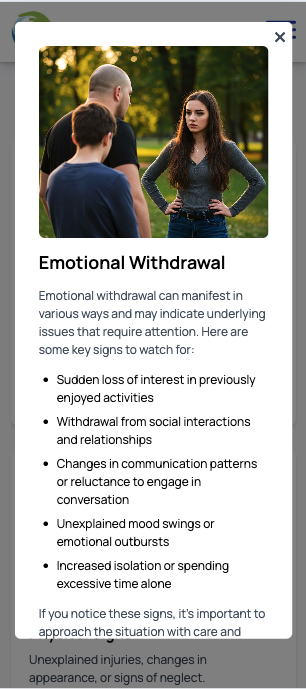
    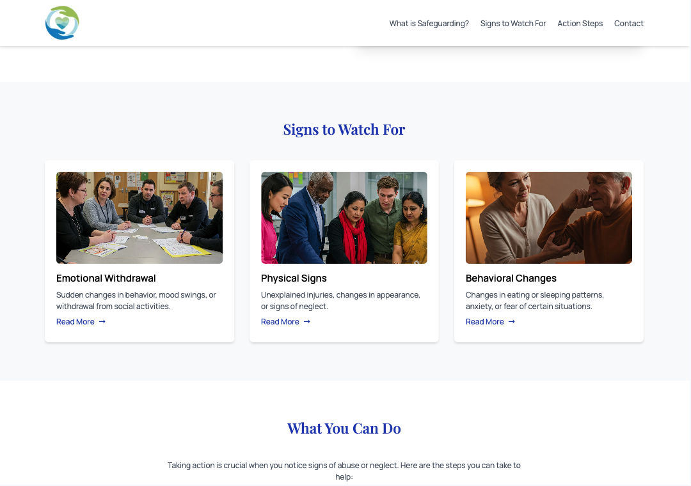
    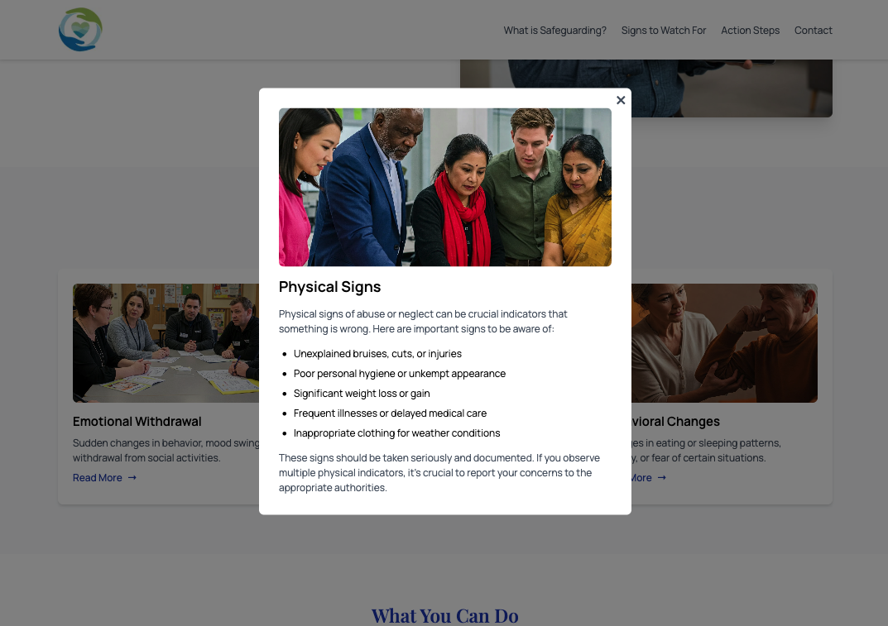

##### What You Can Do

**Description:**  
Provides actionable steps users can take if they suspect safeguarding concerns.

**Benefits for Users:**

- Empowers users to take appropriate action
- Clarifies reporting processes
- Promotes a culture of responsibility

    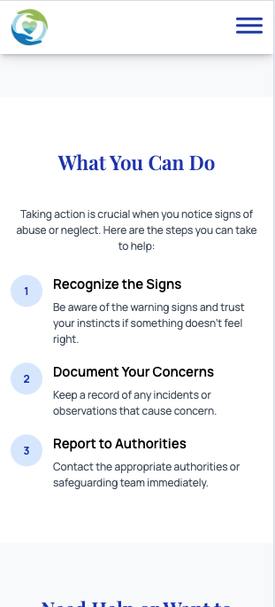
    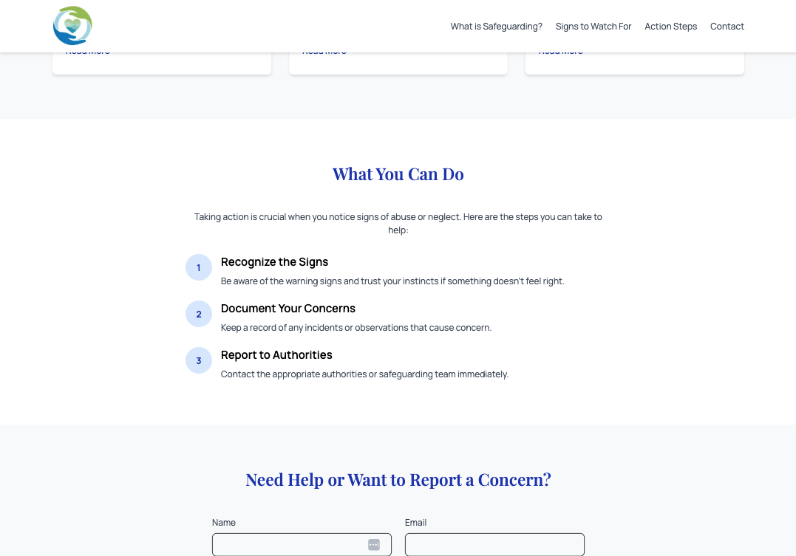

##### Contact Form

**Description:**  
Simple form for users to reach out with concerns, questions, or requests.

**Benefits for Users:**

- Easy way to get help or information
- Encourages open communication
- Builds a direct connection to support

    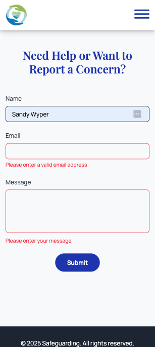
    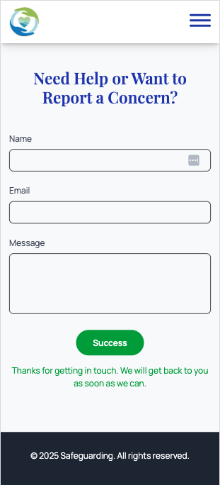
    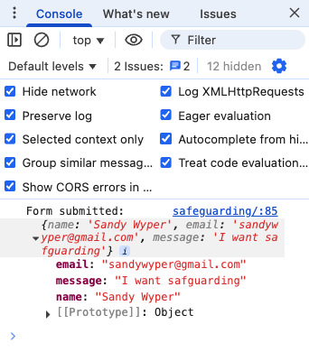
    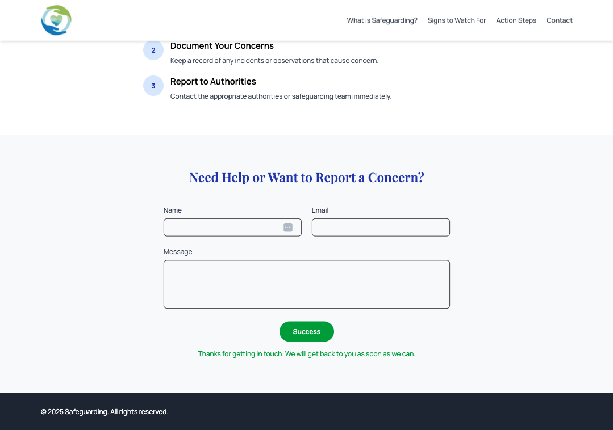

---

### Use of AI in development

I primarily used AI in the design, development and documentation of this website. I have been working as a front-end dev for around 6 years, so for me this was an excellent up-skilling opportunity to see how much I could achieve with AI tools.  
_(Examples of work built without AI can be provided if desired)_

I used chat GPT to provide a detailed responsive design and translate to markdown syntax. I then used that as a prompt in co-pilot. It nearly generated the whole site in one shot, but of course there was some tidying up to do, and extra features that I desired.

I need to give more detail on how the mobile menu should work, reads more buttons with modal content and extra details like that. The contact form was completely AI generated. It uses validation, and success feedback. The data is logged in the console.

For the video modal with YouTube embed, I used co-pilot. The outcome wasn't consistent with other sections, so I pointed to those sections and instructed the agent to amend the modal and button. The results are great, and it only took me 5 mins at most to complete that feature!

There were many occasions where I would need to intervene, and code things myself, or fix bugs as we went... but on the whole, development was super quick and I think about 5 times the speed. I always review any output from chat or agents, and although it would often miss the mark.. with a couple more prompts the results would be spot on!

#### debugging

I could prompt the agent to make styles consistent, or change styles in a sweeping manor. There a few things, mainly around fonts, that I would go in and fix myself, due to preference.
I used AI to add appropriate aria-labels to the necessary elements. Worked a treat! even adjusting the values via js whenever modals are shown or hidden.

#### Lighthouse score (Desktop)

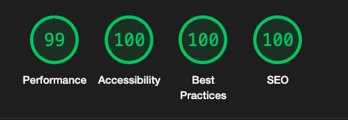
I think I could get that 99 up to 100 by self hosting the Google fonts and adding font-swap. Also I haven't compressed the images or set sizes attribute for different screen widths.
